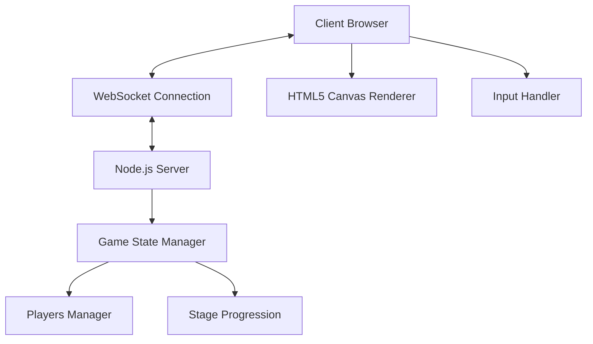
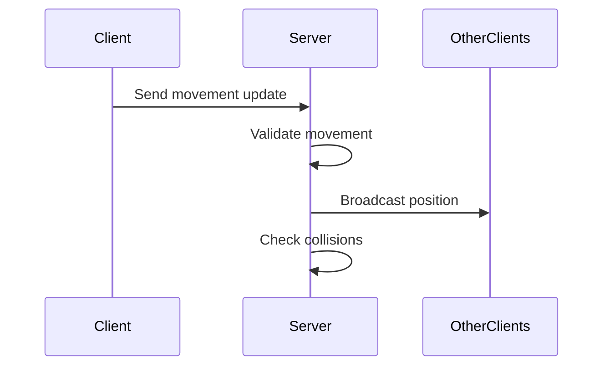
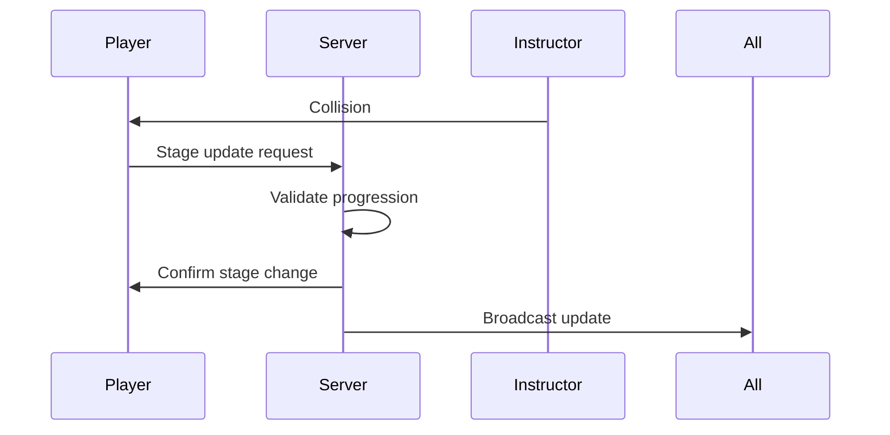

# System Patterns

## Architecture Overview

## Key Components

### Server-Side
1. Game Server (server.js)
   - Express.js web server
   - Socket.io for real-time communication
   - Game state management
   - Player connection handling
   - Stage progression logic

2. Game State Management
   - Tracks player positions
   - Maintains stage states
   - Handles collision detection
   - Manages instructor AI behavior

### Client-Side
1. Game Client (client.js)
   - Canvas rendering system
   - Input handling
   - WebSocket communication
   - Audio management
   - State synchronization

2. User Interface
   - HTML5 Canvas for game rendering
   - CSS for styling and layout
   - Audio elements for sound effects

## Design Patterns

### Observer Pattern
- Socket.io events for real-time updates
- Game state changes broadcast to all clients
- Player movement notifications

### State Pattern
- Player stage progression
- Game phase management
- Emoji state transitions

### Command Pattern
- Player input handling
- Movement commands
- Stage transition commands

## Critical Paths

### Player Movement

### Stage Progression

## Technical Constraints
- Single server instance
- In-memory game state
- Browser compatibility
- WebSocket connection required
- Canvas performance considerations

## Implementation Guidelines
1. Keep game loop efficient
2. Minimize network payload
3. Handle disconnections gracefully
4. Maintain consistent state across clients
5. Optimize collision detection
6. Ensure smooth animations

## Error Handling
- Connection loss recovery
- State synchronization checks
- Invalid movement prevention
- Stage transition validation
- Audio loading fallbacks
